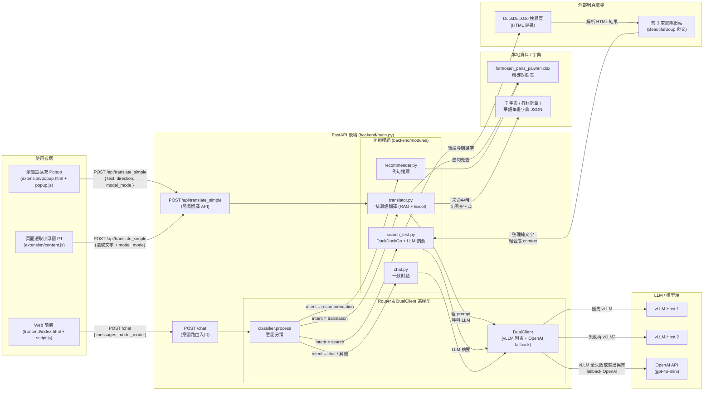

# PaiwanTalk - 排灣語 AI 學習助手

這是一個結合大型語言模型 (LLM) 與檢索增強生成 (RAG) 技術的排灣語學習助手。旨在提供準確的排灣語翻譯、對話練習、例句推薦以及即時資訊查詢功能。

## 功能特色

1.  **智慧意圖判斷 (Intent Classification)**：
    *   系統會根據使用者輸入的對話歷史，自動判斷意圖並路由至對應模組（翻譯、推薦、搜尋或一般閒聊）。

2.  **多模式功能模組**：
    *   **排灣語翻譯 (Translation)**：
        *   **RAG 字典增強**：整合「千字表」、「教材詞彙」與「華語筆畫字典」，在翻譯前先進行精確的詞彙檢索，減少 AI 幻覺。
        *   **智慧擷取**：自動從混合輸入中擷取排灣語部分進行翻譯，過濾中文指令。
    *   **例句推薦 (Recommendation)**：
        *   基於 Excel 資料庫 (`formosan_pairs_paiwan.xlsx`) 隨機推薦排灣語例句，幫助使用者學習。
    *   **即時搜尋 (Search)**：
        *   整合 **DuckDuckGo** 搜尋頁面，模擬使用者在瀏覽器中查詢，擷取前 3 筆結果的網頁內容後再交由 LLM 濃縮。
        *   **在地化優化**：搜尋請求鎖定台灣繁體中文結果，並由 LLM 整理成繁體中文摘要，同時在「思考過程」中列出實際使用的來源網站清單。
    *   **一般對話 (Chat)**：
        *   具備短期記憶的日常對話功能。

3.  **高可用性架構 (DualClient / Triple Redundancy)**：
    *   **多層次備援**：依序嘗試主辦方提供的兩組 vLLM Host (AMD GPU 加速)。
    *   **自動故障轉移 (Failover)**：若 vLLM 無回應、超時 (Timeout) 或輸出亂碼 (如重複驚嘆號)，自動切換至 OpenAI API (GPT-4o-mini) 以確保服務不中斷。
    *   **穩健性設計**：包含 JSON 輸出修復機制 (`extract_structured`)，確保前端顯示正常。

## 專案結構

```
PaiwanTalk/
├── backend/                    # FastAPI 後端
│   ├── main.py                 # 主程式入口 (Router & FastAPI App)
│   ├── modules/                # 功能模組
│   │   ├── classifier.py       # 意圖分類 (Chat, Translation, Recommendation, Search)
│   │   ├── translator.py       # 翻譯模組 (含 RAG 與擷取邏輯)
│   │   ├── recommender.py      # 推薦模組 (Excel 隨機選句)
│   │   ├── search_test.py      # 搜尋模組 (DuckDuckGo + LLM 摘要)
│   │   ├── chat.py             # 一般對話模組
│   │   ├── dual_client.py      # 多重備援客戶端 (vLLM list -> OpenAI)
│   │   └── utils.py            # 工具函式 (JSON 修復等)
│   ├── data/                   # 資料庫
│   │   ├── unique_data.json
│   │   ├── formosan_pairs_paiwan.xlsx  # 推薦句庫
│   │   └── ... (其他字典檔)
│   └── paiwan_translation_api_multi.py # 字典查詢核心邏輯
├── frontend/                   # 網頁前端
│   ├── index.html
│   ├── script.js
│   └── style.css
├── extension/                  # Chrome / Edge 擴充功能範本 (Manifest V3)
│   ├── manifest.json
│   ├── background.js           # 右鍵選單 -> 交由 popup / content script 處理
│   ├── popup.html              # 工具列小視窗 (可輸入文字翻譯 + 選模型)
│   ├── popup.js
│   ├── content.js             # 在網頁上選取文字後顯示「PT」小浮窗並就地翻譯
│   └── README.txt
└── requirements.txt            # Python 依賴
```

## 安裝與執行

### 1. 環境設定

建議使用虛擬環境 (Virtual Environment) 以避免套件衝突。

```bash
# 建立虛擬環境 (若尚未建立)
python3 -m venv ~/paiwantalk-venv

# 啟動虛擬環境
source ~/paiwantalk-venv/bin/activate

# 安裝依賴套件
pip install -r requirements.txt
```

### 2. 設定環境變數

專案使用 `.env` 檔案管理設定。請在 `backend/` 目錄下確認或建立 `.env`：

```env
OPENAI_API_KEY="your_openai_api_key"
VLLM_BASE_URL="http://host1:port/v1/"
VLLM_BASE_URL_2="http://host2:port/v1/"
VLLM_API_KEY="dummy-key"
```

### 3. 啟動後端伺服器

進入 `backend` 目錄並啟動 FastAPI：

```bash
cd backend
# 使用虛擬環境中的 uvicorn
~/paiwantalk-venv/bin/uvicorn main:app --host 0.0.0.0 --port 8000 --reload
```

伺服器將在 `http://0.0.0.0:8000` 啟動。

### 4. 啟動前端

您可以直接開啟 `frontend/index.html`，或使用簡易 HTTP Server：

```bash
cd frontend
python3 -m http.server 8080
```

打開瀏覽器訪問 `http://localhost:8080` 即可使用。

## 瀏覽器擴充功能：PaiwanTalk 翻譯擴充套件

本專案提供一個可直接載入於 Chrome / Edge 的 Manifest V3 擴充功能範本，方便在任意網頁上選取排灣語文字並立即翻譯。

### 1. 功能說明

- **工具列 Popup 翻譯**：
    - 點擊瀏覽器工具列的「PaiwanTalk 翻譯」圖示，會開啟一個小視窗。
    - 輸入排灣語句子後按下「翻譯成中文」，會透過後端 `/api/translate_simple` 取得翻譯結果與思考說明。
    - 可在下拉選單中選擇使用的模型模式：
        - 預設（主辦 vLLM + 你的 OpenAI API 混合）
        - 只用主辦模型 (`vllm_only`)
        - 只用自己的 OpenAI API (`openai_only`)
    - 所選模型會記錄在瀏覽器的 `chrome.storage` 中，之後會沿用同一設定，直到你再次更改。

- **選取文字後的小浮窗 (PT 氣泡)**：
    - 在任意網頁選取排灣語文字後，游標附近會出現一個小方塊按鈕「PT」。
    - 點擊「PT」後，小方塊會顯示「翻譯中...」，並呼叫同一個翻譯 API。
    - 完成後，小方塊會直接顯示翻譯結果，方便就地閱讀，不需要切換頁面。
    - 小方塊會跟隨你最後在 Popup 中選擇的模型模式。

### 2. 安裝與測試（開發階段）

1. 確保後端已啟動：

     ```bash
     cd backend
     ~/paiwantalk-venv/bin/uvicorn main:app --host 0.0.0.0 --port 8000 --reload
     ```

2. 在 Chrome / Edge 載入未封裝擴充功能：
     - 打開「擴充功能 / 擴充套件」管理頁。
     - 開啟「開發人員模式」。
     - 點「載入未封裝項目」（Load unpacked）。
     - 選擇專案中的 `extension/` 資料夾。

3. 測試方式：
     - **工具列 Popup**：
         - 點擴充圖示 → 在文字框輸入排灣語 → 按「翻譯成中文」。
     - **頁面選取翻譯**：
         - 在任意網頁上選取一段排灣語文字。
         - 點選出現的「PT」小方塊 → 觀察翻譯結果與反應速度。

> 若你修改了擴充程式程式碼（如 content.js / popup.js），請記得在擴充管理頁點「重新載入」，並重新整理要測試的網頁，確保新的內容腳本已被注入。

## 技術細節

*   **Backend Framework**: FastAPI
*   **LLM Integration**: AsyncOpenAI SDK (Compatible with vLLM & OpenAI)
*   **Search**: DuckDuckGo HTML Search + BeautifulSoup + LLM 摘要
*   **Data Processing**: Pandas, OpenPyXL (Excel handling), FuzzyWuzzy (String matching)
*   **Frontend**: Vanilla JavaScript, HTML5, CSS3
*   **Browser Extension**: Chrome / Edge Manifest V3, Background Service Worker + Content Scripts + Action Popup

## 系統架構圖

以下為 PaiwanTalk 目前的整體流程架構（可在支援 Mermaid 的 Markdown 檢視器中直接渲染）：



---
Developed for AMD AI Agent Online Hackathon.
